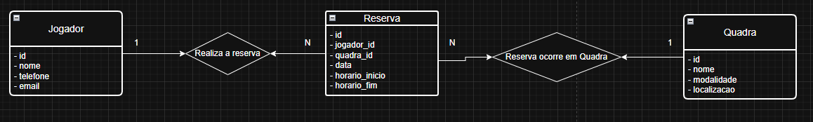

# AVA-DESENVOLVIMENTO-FULL-STACK-B-SICO-PROJETO-DFS-2026.2

Links Importantes:
Trello: https://trello.com/b/k3P2zFfr/ava-desenvolvimento-full-stack-b-sico-projeto-dfs-20262
GitHub: https://github.com/VitorPantojaDev/AVA-DESENVOLVIMENTO-FULL-STACK-B-SICO-PROJETO-DFS-2026.2

Problema: Sistema de Agendamento de Quadras Esportivas

Contexto
Em muitas quadras esportivas de bairros, escolas ou condomínios, a reserva de horários é feita de forma desorganizada, utilizando cadernos, grupos de mensagens ou apenas por ordem de chegada. Essa prática pode gerar conflitos de horário, dificultar a visualização da disponibilidade das quadras e prejudicar a organização das partidas.

Com o objetivo de tornar esse processo mais simples e organizado, será desenvolvida uma aplicação web que permitirá cadastrar quadras, registrar jogadores e realizar reservas de horários, facilitando o gerenciamento da agenda das quadras esportivas.

Objetivo

Desenvolver uma aplicação web funcional que permita cadastrar jogadores e quadras, realizar reservas de horários e consultar a agenda das quadras. A aplicação deve possibilitar o gerenciamento das reservas de forma simples, evitando conflitos de horário.

Funcionalidades do Sistema

1. Cadastro de Jogadores
2. 
O sistema deve permitir o cadastro de jogadores que utilizarão as quadras.

O cadastro deve conter:

● Nome completo

● E-mail

● Telefone

3. Cadastro de Quadras
   
O sistema deve permitir o cadastro das quadras esportivas disponíveis.

Cada quadra deve possuir:

● Nome da quadra (Ex.: Quadra Society, Quadra de Vôlei)

● Modalidade esportiva (Futebol, Vôlei, Basquete, Tênis, etc.)

● Localização

5. Cadastro de Reservas
   
O sistema deve permitir o cadastro de reservas para utilização das quadras.

Cada reserva deve conter:

● Jogador responsável

● Quadra

● Data

● Horário de início

● Horário de fim

O sistema deve verificar se já existe uma reserva para o mesmo horário na mesma quadra. Caso exista conflito, a nova reserva não deverá ser cadastrada.

7. Visualização da Agenda
   
Os usuários da aplicação devem poder consultar as reservas realizadas.

A visualização deve apresentar:

● Lista de reservas contendo quadra, jogador, data e horário.

● Consulta da agenda por quadra.

● Identificação dos horários ocupados e disponíveis.

Requisitos Técnicos

Backend

O backend será responsável pela lógica da aplicação e gerenciamento dos dados. Deve ser desenvolvido utilizando:

● Node.js com Express.

● Prisma ORM para realizar as operações no banco de dados.

● Implementação das operações de CRUD (Create, Read, Update, Delete) para jogadores, quadras e reservas.

● Validação para impedir reservas em horários já ocupados para a mesma quadra.

Banco de Dados

Utilizar um banco de dados relacional, como PostgreSQL, para armazenar as informações da aplicação.

Estrutura básica do banco:

Jogadores: Armazena os dados dos usuários do sistema.
(id, nome, email, telefone)

Quadras: Armazenar as quadras disponíveis.
(id, nome, modalidade, localizacao)

Reservas: Armazena os horários reservados.
(id, jogador_id, quadra_id, data, horario_inicio, horario_fim)

Observação: A estrutura do banco de dados é apenas uma sugestão inicial. As equipes podem adicionar novos atributos, tabelas e relacionamentos sempre que julgarem necessário para melhorar a aplicação.

Frontend

O frontend deverá ser desenvolvido com ReactJS, fornecendo uma interface simples e amigável.

O frontend deve:

● Exibir a agenda de reservas das quadras.

● Possuir formulários para cadastro de jogadores, quadras e reservas.

● Permitir edição e remoção de reservas.

● Incluir uma landing page apresentando o sistema e incentivando a prática esportiva na comunidade.

Extras (Desafios Opcionais)

1. Filtros
Implementar filtros para facilitar a consulta das reservas, como:

● Busca por data.

● Busca por modalidade esportiva.

● Busca por quadra.

3. Autenticação (Opcional)
   
Implementar um sistema de autenticação para usuários.

Após o login:

● Jogadores poderão visualizar suas próprias reservas.

● Um usuário administrador poderá cadastrar, editar e excluir quadras, além de gerenciar reservas.

Observação: O sistema de login não é obrigatório para o funcionamento da aplicação.

Diretrizes Gerais

O desafio deverá ser realizado pelas equipes já organizadas, com foco no cadastro e gerenciamento de jogadores, quadras e reservas. As equipes têm liberdade para adicionar novos campos, entidades ou funcionalidades que considerem relevantes, desde que as funcionalidades básicas sejam atendidas.

Versionamento do Projeto e Trabalho em Equipe

As equipes devem utilizar o GitHub para versionamento e colaboração. No dia da entrega, apenas um integrante do grupo deverá enviar:

● O link do repositório no GitHub.

● Uma descrição da contribuição de cada membro da equipe.

Enviar para os e-mails:

● jheyele_xavier@atlantico.com.br

● julia_freitas@atlantico.com.br

● murilo_scapim@atlantico.com.br

No repositório, deve existir uma documentação (README) explicando:

● O objetivo do projeto.

● As tecnologias utilizadas.

● As instruções para executar a aplicação.

Datas de Entrega

Backend: até 25/07/2026
Frontend: até 22/08/2026
